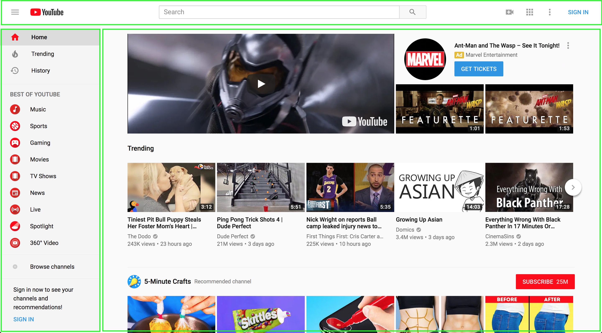

# Why
* Give you ideas about what to do on your personal sites
* Show you how a developer might think through things
* Cover techniques we might not have covered yet so you can decide what you'd like to review further

# Scaffolding
* Add `index.html` with HTML structure
* Add `styles` folder
* Add `reset` and `main` stylesheets and link them to `index.html`

# Planning
* Determine sections of the page

* Add those sections to the HTML
  * Use classes for each element. This keeps our CSS separate from our markup (HTML). We can make changes to the HTML later, and as long as we use the same class names we won't have to make changes to the CSS (e.g. if we need to change the `main` tag to a `div` or `section`)

# Layout
* Add temporary background colors to your elements so you can see what the default layout is
* Use grid to make the sections fill the correct spaces

# Building the sections

## Header
* List the pieces that we'll be adding to the header
* Replace each part with an element

## Nav

### Nav Placeholders

* Add `div`s for the 7 sections
* Give the `div`s class names: `.sidebar_section` which we'll use for all of the styles each section has in common, and modifier classes for the section-specific styles
* Let's add the modifier names to the classes and add placeholder text to each div
  * Naming things is hard (Google it. It's true). Try to come up with a good name, don't worry if it's not a perfect name.
* Let's make the last div a `footer`. This way the browser knows that this is where the traditional footer stuff is.
  * Remember how we started off using class names in our styles instead of elements? Changing the `div` to a `footer` is an example of why. If we'd already started creating styles, then later realized we needed to use a different, better-suited element, we wouldn't have to change our CSS as well.

### Nav Items
* Let's use lists for the nav items. This tells the browser that the nav links are groups of related options. You've been using lists to create your nav bars already.

## Content
* Add a `div` for ads (`.ad`) at the top
* Add a `div` for videos. This will be our first video row
* Our videos are another type of list, so we'll use `ul` and `li` tags
* We can use `p` tags for any block of text, not just full paragraphs. We'll wrap `views` and `time` together because we'll display them in one line
* For the video element, we'll wrap it in a `wrapper` div. This way we can apply styles to the `div` rather than directly to the element. We'll set dimensions on the `div`, and whether we use a `video` element, an `iframe` or a placeholder image, we can style the child element to grow to fill the `div`.
* Right now our `video` element leaves a blank space. Let's use a placeholder video from https://coverr.co/. When we finish you can add your own videos.
  * Chrome doesn't allow autoplay of videos (because it can annoy your site's visitors). Two options: 1) add the `muted` attribute and Chrome will allow the video to autoplay, 2) add the `controls` attribute and the user can click play to start the video
* After you have the structure of one `.video_item`, duplicate that so that our category has 5 videos.
* Next, copy the `.videos_row` so that you have at least 5 rows
* In our `main.css` file, add a temporary border style to `.videos_row` so that we can see where each row begins and ends

# Styles

## Videos
* Now that we have all of our markup, let's add styles
* We'll start with the videos because they're huge and making them the right size is really going to help our site start to take shape
* Just a few styles will arrange and size the videos
  * Set a `max-width` on `.video_wrapper`
  * Style `.video_media` with `object-fit` and a `width`
  * Use flexbox on `.video_list`

## Scrolling
* The navigation and content areas each scroll independently. We can do that with the CSS property `overflow`
  * We also need to set our row to the height of the page minus the height of the header (instead of `auto`), using `calc`
